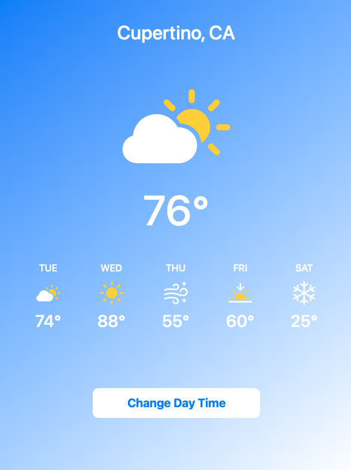
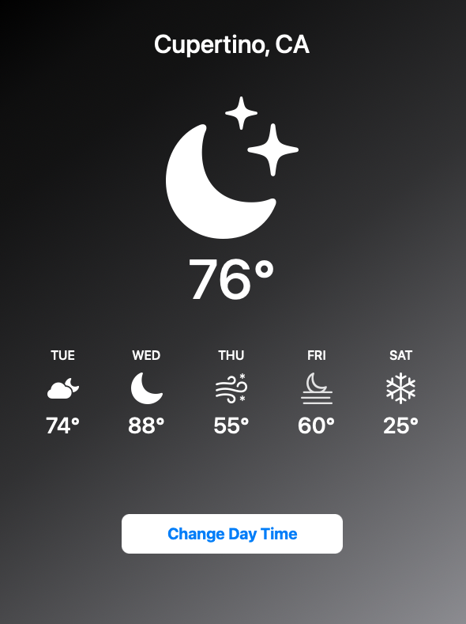

# SwiftUI Weather App
This is a simple SwiftUI weather app that displays the weather information for a specific location. The app allows you to toggle between day and night mode and shows the current temperature along with the weather forecast for the next few days.

# Preview
## Weather App Day View

## Weather App Night View

# Features
Displays the current city name
Shows the main weather status with an appropriate weather icon
Displays the temperature in degrees Fahrenheit
Shows the weather forecast for the next five days
Toggle between day and night mode
Change the day time by tapping the "Change Day Time" button

# Usage
Clone or download the project files.
Open the project in Xcode.
Build and run the app on a simulator or a physical device.

# Requirements
Xcode 12 or later
iOS 14 or later

# Implementation
The app is implemented using SwiftUI, Apple's declarative framework for building user interfaces. It consists of the following components:

- **ContentView:** The main view of the app, responsible for displaying the weather information and providing the user interface elements.

- **WeatherDayView:** A view that displays the weather information for a specific day, including the day of the week, weather icon, and temperature.

- **BackgroundView:** A view that provides the background gradient for the app, with colors changing based on day or night mode.

- **CityTextView:** A view that displays the name of the city.

- **MainWeatherStatusView:** A view that shows the main weather status, including an appropriate weather icon and the current temperature.

- **WeatherButton:** A custom button view that can be used to trigger actions.

# License
This project is licensed under the MIT License. See the LICENSE file for details.

Feel free to customize and enhance the app according to your needs. Enjoy building with SwiftUI!
